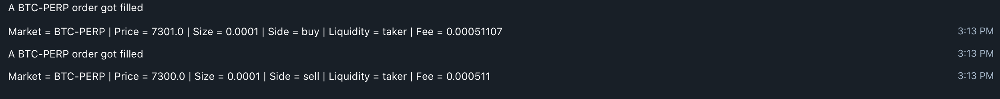

# Setup the bot

Enter your API keys in parameters.py

# Launch the bot

```
chmod +x path/to/main.py
nohup path/to/main.py &
```

Each time an order got filled on FTX, your bot will send you a message with the following information:
.* Market name
.* Price
.* Size
.* Side
.* Liquidity
.* Fee


